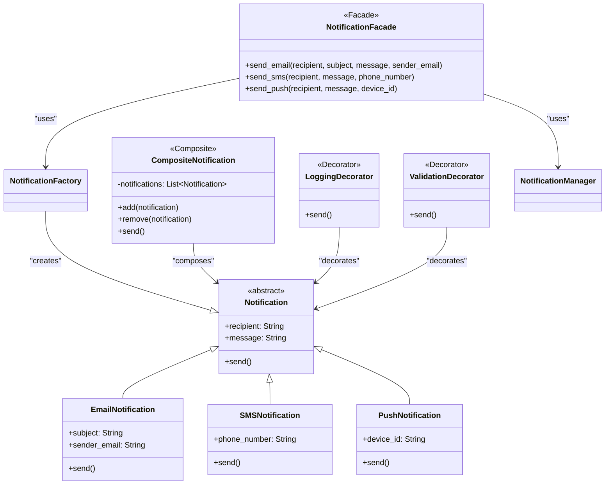

# Notification System

## Structural Design Patterns

A simple Python-based Notification System demonstrating three structural design patterns: **Facade**, **Composite**, and **Decorator**.

## Table of Contents

- [Introduction](#introduction)
- [Design Patterns Implemented](#design-patterns-implemented)
  - [Facade Pattern](#facade-pattern)
  - [Composite Pattern](#composite-pattern)
  - [Decorator Pattern](#decorator-pattern)
- [Project Structure](#project-structure)
- [Installation](#installation)
- [Usage](#usage)
- [Testing](#testing)
- [Contributing](#contributing)
- [License](#license)

## Introduction

This project extends a Notification System by implementing several **structural design patterns** to improve flexibility, maintainability, and ease of use. The system supports creating and sending different types of notifications, such as Email, SMS, and Push notifications.

### Objectives

1. **Understand and implement structural design patterns**: We applied **Facade**, **Composite**, and **Decorator** patterns to enhance our system.
2. **Enhance the Notification System**: Adding new features using these patterns makes the system more flexible and scalable.
3. **Improve maintainability**: By organizing the codebase and creating simplified interfaces, we make the system more adaptable to future requirements.

## Some Theory

In software engineering, **Structural Design Patterns** focus on the organization and composition of classes and objects. These patterns help with creating larger structures while ensuring flexibility and maintainability. Here are a few common structural design patterns:

- **Facade**
- **Composite**
- **Decorator**
- **Bridge**
- **Flyweight**
- **Adapter**
- **Proxy**

## Design Patterns Implemented

## Facade Pattern

### **Purpose**
The **Facade Pattern** provides a simplified interface to a complex subsystem, hiding the complexities and making it easier to use. The goal is to provide a **higher-level interface** that makes a system easier to use and understand.

### **When to Use**
Use the **Facade Pattern** when:

- You want to **provide a simplified interface** to a complex system of objects.
- The system has a large number of **interdependent classes**, and you want to **reduce coupling** by abstracting that complexity.
- You want to make the system easier to use for the client without exposing the internal workings.

### **Implementation**
The `NotificationFacade` class provides a simplified interface for sending **Email**, **SMS**, and **Push** notifications. This hides the complexity of managing different notification types behind a unified method.

### **Structure**
1. **Facade**:
   - The **Facade** class provides a simplified, unified interface to the complex subsystem. 
   - The facade delegates the work to the appropriate classes in the subsystem.
   - It provides a high-level method for the client to interact with, making the system easier to use.

2. **Subsystems**:
   - These are the classes that implement the **complex logic**, which the facade hides.
   - The facade coordinates calls to these subsystems but doesn’t expose their internal details to the client.

### **Example Implementation**

```python
# facade/notification_facade.py
from factory.notification_factory import NotificationFactory
from domain.notification_manager import NotificationManager

class NotificationFacade:
    def __init__(self):
        self.manager = NotificationManager()

    def send_email(self, recipient, subject, message, sender_email):
        email = NotificationFactory.create_notification(
            'email', recipient, message, subject=subject, sender_email=sender_email
        )
        self.manager.add_notification(email)
        self.manager.send_all()

    def send_sms(self, recipient, message, phone_number):
        sms = NotificationFactory.create_notification('sms', recipient, message, phone_number=phone_number)
        self.manager.add_notification(sms)
        self.manager.send_all()

    def send_push(self, recipient, message, device_id):
        push = NotificationFactory.create_notification('push', recipient, message, device_id=device_id)
        self.manager.add_notification(push)
        self.manager.send_all()
```

### Usage
```python
# client/main.py
from facade.notification_facade import NotificationFacade

def main():
    facade = NotificationFacade()

    # Sending notifications via the facade
    facade.send_email(
        recipient='john.doe@example.com',
        subject='Welcome!',
        message='Welcome to our service!',
        sender_email='support@example.com'
    )
    
    facade.send_sms(
        recipient='Jane Doe',
        message='Your verification code is 123456.',
        phone_number='+1234567890'
    )
    
    facade.send_push(
        recipient='User123',
        message='You have a new friend request.',
        device_id='device_xyz'
    )

if __name__ == "__main__":
    main()
```

## Composite Pattern

### **Purpose**
The **Composite Pattern** is used to treat individual objects and compositions of objects uniformly. This pattern allows you to compose objects into tree-like structures to represent part-whole hierarchies. It is particularly useful when you need to treat groups of objects (composites) in the same way as individual objects.

### **When to Use**
Use the **Composite Pattern** when:

- You need to represent **part-whole hierarchies**.
- You want to treat individual objects and their compositions (groups of objects) **uniformly**.
- The structure of objects is **hierarchical** or **tree-like**.

For example, in a notification system, you might want to group individual notifications (like **email**, **SMS**, or **push notifications**) into a single **composite notification** that can be sent as one unit.

### **Structure**

The **Composite Pattern** has the following components:

1. **Component**:
   - The **interface** that both the concrete component and decorators will implement.
   - This defines the operations that can be performed on the objects (e.g., `send()`).

2. **Concrete Component**:
   - The **original object** being decorated, e.g., a basic **Notification** object (e.g., `EmailNotification`, `SMSNotification`, `PushNotification`).

3. **Decorator**:
   - The **abstract class** that wraps the concrete component and adds additional functionality (e.g., logging, validation).
   
4. **Concrete Decorators**:
   - These are the actual classes that implement the additional behavior.
   - For example, **LoggingDecorator** or **ValidationDecorator** can extend the behavior of the **Notification** object.

### **Example Implementation**
```python
# domain/composite_notification.py
from models.notification import Notification

class CompositeNotification(Notification):
    def __init__(self, recipient, message):
        super().__init__(recipient, message)
        self.notifications = []

    def add(self, notification):
        self.notifications.append(notification)

    def remove(self, notification):
        self.notifications.remove(notification)

    def send(self):
        for notification in self.notifications:
            notification.send()  # Delegate sending to each contained notification
```

**Usage**
```python
# client/main.py
from domain.composite_notification import CompositeNotification
from models.email_notification import EmailNotification
from models.sms_notification import SMSNotification
from models.push_notification import PushNotification

def main():
    # Create a composite notification
    composite = CompositeNotification(recipient='Group1', message='Group notification')

    # Add individual notifications to the composite
    composite.add(EmailNotification('john.doe@example.com', 'Group Email', 'Hello, Group!', 'support@example.com'))
    composite.add(SMSNotification('Jane Doe', 'Your group code is 123456.', '+1234567890'))
    composite.add(PushNotification('User123', 'You have a new group message.', 'device_xyz'))

    # Send the composite notification
    composite.send()

if __name__ == "__main__":
    main()
```


## Decorator Pattern

### **Purpose**
The **Decorator Pattern** allows you to dynamically add new responsibilities to an object without altering its structure. It provides a flexible alternative to subclassing for extending functionality.

### **When to Use**
Use the **Decorator Pattern** when:

- You need to **add responsibilities** to an object without modifying its code.
- You want to **extend an object’s functionality** dynamically at runtime.
- You need to **keep the object structure intact** while adding new features or behaviors.

### **Implementation**
The **Decorator Pattern** is implemented by creating a decorator class that wraps an existing class and extends its behavior. In our Notification System, decorators can be used to add features such as **logging**, **validation**, or **encryption** to the notifications without modifying the core notification classes.

### **Structure**
1. **Component**:
   - This is the **interface** that both the concrete component and decorators will implement.
   - This defines the operations that can be performed on the objects (e.g., `send()`).

2. **Concrete Component**:
   - This is the **original object** being decorated (e.g., a simple **Notification** object like `EmailNotification`, `SMSNotification`, `PushNotification`).

3. **Decorator**:
   - This is the **abstract class** that wraps the concrete component and adds additional functionality (e.g., logging, validation).
   - It implements the same interface as the component to ensure that the decorated object can be used interchangeably.

4. **Concrete Decorators**:
   - These are the **actual classes** that implement the additional behavior (e.g., **LoggingDecorator** or **ValidationDecorator**).
   - They enhance or extend the functionality of the original object without changing its structure.

### **Example Implementation**

```python
# decorators/logging_decorator.py
class LoggingDecorator:
    def __init__(self, notification):
        self._notification = notification  # The notification object to be decorated

    def send(self):
        # Log before sending the notification
        print(f"Logging: Sending {self._notification.__class__.__name__} to {self._notification.recipient}")
        
        # Call the send method of the actual notification object
        self._notification.send()
```

 **Example Implementation**
 ```python
 # client/main.py
from decorators.logging_decorator import LoggingDecorator
from decorators.validation_decorator import ValidationDecorator
from facade.notification_facade import NotificationFacade
from models.email_notification import EmailNotification
from models.sms_notification import SMSNotification
from models.push_notification import PushNotification

def main():
    facade = NotificationFacade()

    # Create Email Notification
    email = EmailNotification(
        recipient='john.doe@example.com',
        message='Hello, Group!',
        subject='Group Email',
        sender_email='support@example.com'
    )

    # Apply LoggingDecorator to add logging functionality
    validated_email = LoggingDecorator(email)
    validated_email.send()  # This will log the send operation and then send the email.

    # Create SMS Notification
    sms = SMSNotification(
        recipient='Jane Doe',
        message='Your verification code is 123456.',
        phone_number='+1234567890'
    )

    # Apply both Logging and Validation decorators before sending SMS
    validated_sms = ValidationDecorator(LoggingDecorator(sms))
    validated_sms.send()  # This will log and validate the SMS before sending it.

    # Create Push Notification
    push = PushNotification(
        recipient='User123',
        message='You have a new friend request.',
        device_id='device_xyz'
    )

    # Apply LoggingDecorator to add logging functionality
    validated_push = LoggingDecorator(push)
    validated_push.send()  # This will log the send operation and then send the push notification.

if __name__ == "__main__":
    main()
```

## Project Structure
lab2/notification-system/
│
├── client/
│ ├── __init__.py
│ └── main.py # Main script for running the notification system
│
├── domain/
│ ├── __init__.py
│ ├── notification_builder.py # Builder for customizing notifications
│ └── notification_manager.py # Singleton manager for handling notifications
│
├── factory/
│ ├── __init__.py
│ └── notification_factory.py # Factory for creating notifications based on type
│
├── models/
│ ├── __init__.py
│ ├── email_notification.py # Email Notification class
│ ├── notification.py # Base Notification class
│ ├── push_notification.py # Push Notification class
│ └── sms_notification.py # SMS Notification class
│
├── decorators/
│ ├── __init__.py
│ └── logging_decorator.py # Logging decorator for notifications
│
├── tests/
│ ├── __init__.py
│ └── test_singleton.py # Test file for Singleton pattern
│
├── README.md # Project documentation
├── requirements.txt # Project dependencies
└── .gitignore # Git ignore file


## Setup and Installation
git clone https://github.com/dariabriannaa/notification-system.git
cd lab2/notification-system

# Install dependencies
pip install -r requirements.txt

# Running the Application
python3 -m client.main


## Diagram



## Conclusion

By implementing structural design patterns like **Facade**, **Composite**, and extending the **Decorator** pattern, we have successfully added flexibility and scalability to the **Notification System**. These patterns have not only helped organize the system but also provided a clear pathway for future extensions and improvements. Here’s how each of these patterns has contributed to the system's evolution:

### **Facade Pattern: Simplification of Complex Subsystems**
The **Facade Pattern** has significantly simplified interactions with the complex subsystems in the Notification System. By introducing the `NotificationFacade` class, we have provided a simplified, unified interface for sending various types of notifications (Email, SMS, Push). This approach has several benefits:

- **Simplified Client Interaction**: Users now have a single entry point for sending any notification type, reducing the need to interact with the underlying complexities.
- **Reduced Complexity**: The `NotificationFacade` class hides the complexity of managing multiple notification types, such as Email, SMS, and Push. This allows clients to focus on just the logic they care about, without having to worry about the internal workings.
- **Decoupled Subsystems**: The facade helps reduce the coupling between the client and the complex subsystems. Different types of notifications can be modified or extended without affecting the client code.

With the **Facade Pattern**, we've significantly improved the **user experience** and **maintainability** of the system, as changes or extensions to the notification types no longer require updates to the client code.

### **Composite Pattern: Managing Hierarchical Structures**
The **Composite Pattern** has enabled us to manage part-whole hierarchies of notifications. Through the `CompositeNotification` class, we can treat a collection of notifications (e.g., Email, SMS, and Push notifications) as a single entity. This pattern brings several advantages:

- **Efficient Grouping of Notifications**: We can group individual notifications into a single composite, allowing us to treat them uniformly. This is particularly useful when you need to send the same notifications to multiple recipients at once.
- **Flexibility in Handling Part-Whole Relationships**: Whether it's a single notification or a group of notifications, we can manage both in the same way, leading to a more **flexible** system.
- **Scalability**: The **Composite Pattern** makes it easy to add new notification types or extend existing groups of notifications, facilitating the system's future growth.

This pattern has proven to be key in **organizing complex data structures** and efficiently managing groups of notifications, paving the way for even more complex use cases, such as creating campaigns that send multiple types of notifications simultaneously.

### **Decorator Pattern: Extending Functionality Dynamically**
The **Decorator Pattern** has been a game changer for dynamically extending the behavior of notifications without modifying their core functionality. By applying decorators like **LoggingDecorator** and **ValidationDecorator**, we have been able to:

- **Add New Responsibilities Dynamically**: We can now add behaviors like logging or validation to notifications on the fly, without altering the core `Notification` classes.
- **Enhanced Flexibility**: The pattern allows us to compose and combine different decorators, adding as many functionalities as needed. This gives us the flexibility to **dynamically extend** the notification system at runtime.
- **Separation of Concerns**: By using decorators, we keep the added behaviors (like logging or validation) separate from the core notification logic, making the code easier to maintain and extend.

This pattern has proven invaluable for adding non-intrusive, reusable behaviors to existing notification objects, such as **logging**, **validation**, or **encryption**, enhancing the system’s **modularity**.

### **Final Thoughts**
The combination of these **structural design patterns** has provided a solid foundation for the Notification System, offering a highly **scalable**, **maintainable**, and **flexible** architecture. By applying the **Facade**, **Composite**, and **Decorator** patterns, we've created a system that:

- **Simplifies the process of interacting with multiple subsystems** (Facade).
- **Organizes complex data structures** for managing notifications in a hierarchy (Composite).
- **Dynamically adds functionalities**, such as logging and validation, without modifying the core system (Decorator).

These design patterns enable the system to grow and evolve, supporting additional features and more complex workflows in the future. The architecture is now ready to handle new notification types, additional behaviors, or integration with other systems, all while maintaining a **clean**, **modular**, and **extensible** codebase.
